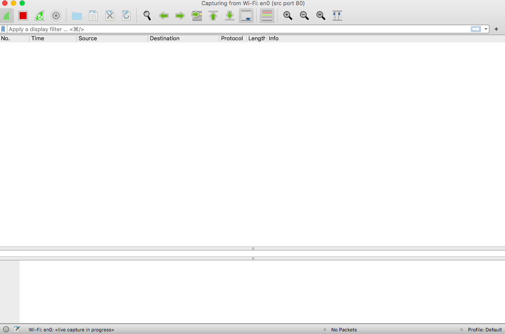
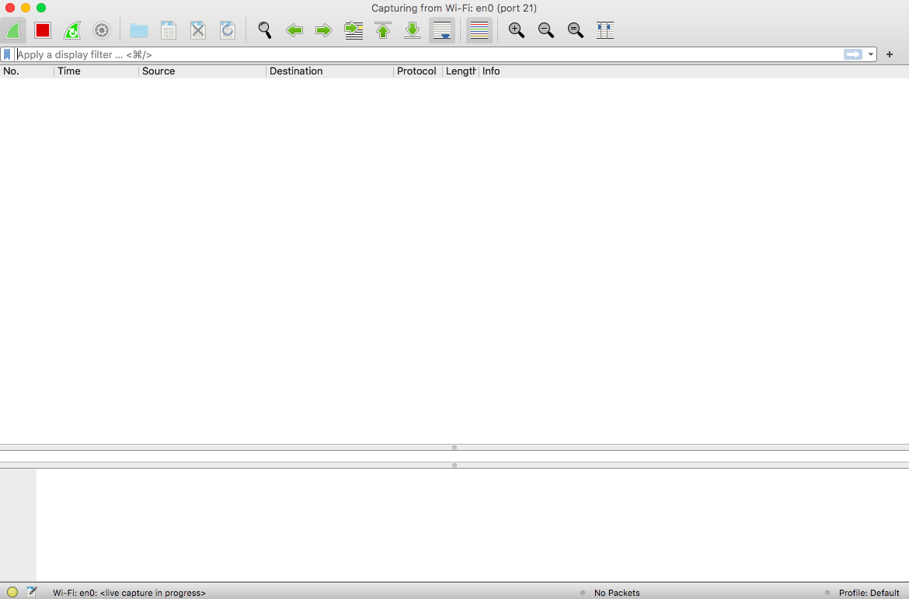
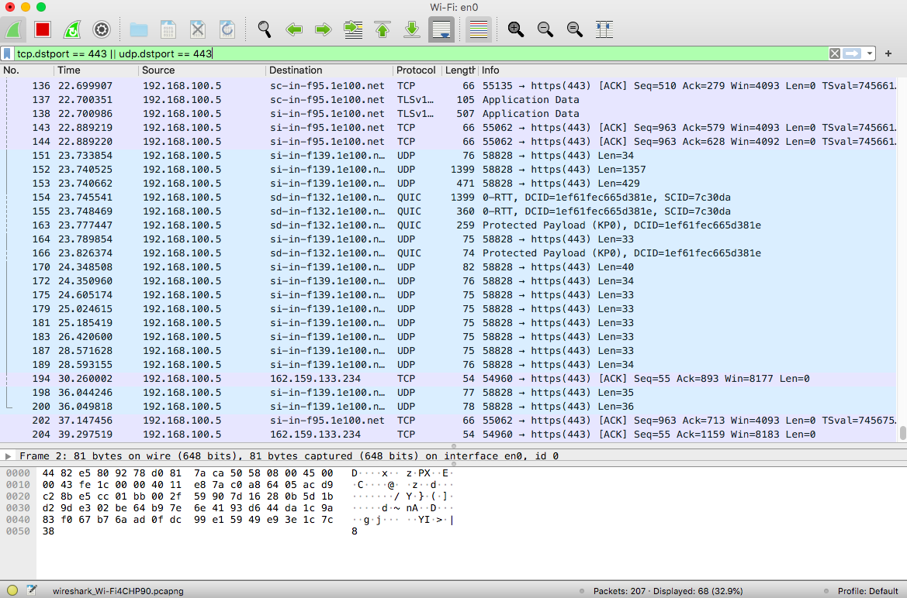
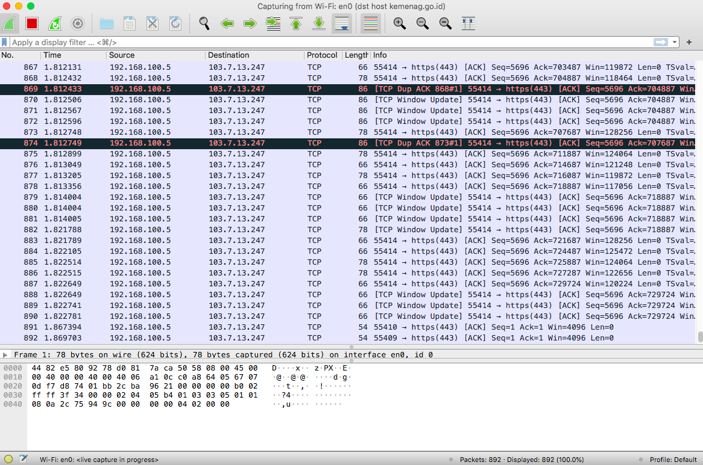
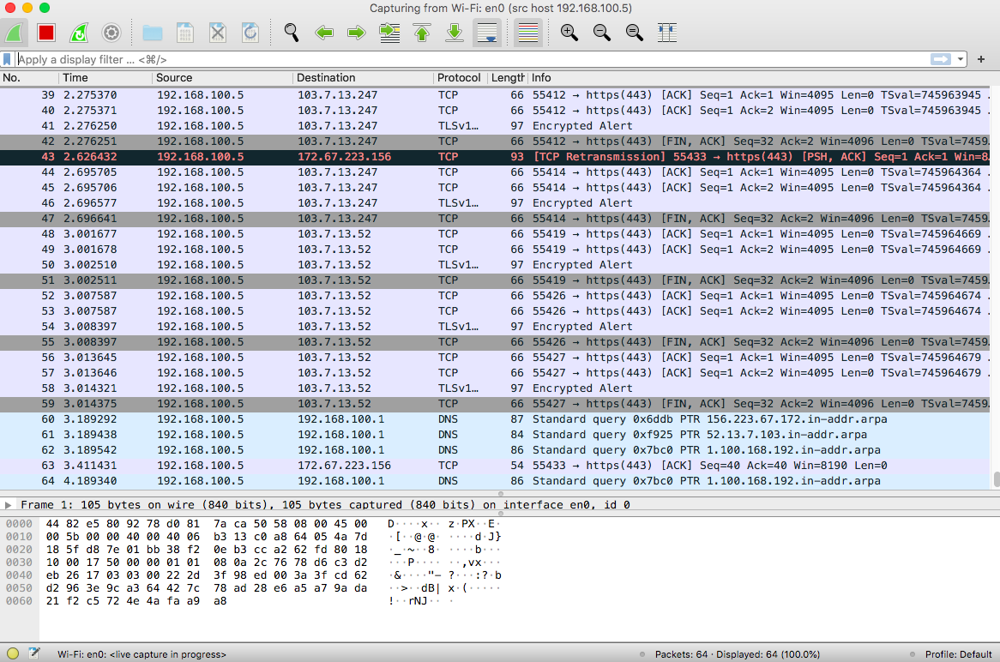

# Jarkom-Modul-1-C15-2021

### Anggota Kelompok
1. Gerald Elroy Van Ryan 05111940000187
2. Gian Ega              05111940000204
3. Riza Dwi Andhika      05111940000149

## Soal 1

```
Sebutkan webserver yang digunakan pada "ichimarumaru.tech"! 
```

**Filter** : http.host == "ichimarumaru.tech"

**Cara pengerjaan** :
Masukkan filter di atas pada wireshark, lalu pilih salah satu paket yang muncul. Setelah itu, ***follow TCP Stream*** pada paketnya untuk mendapatkan webserver yang digunakan.

**Screenshot** :
1. Hasil paket yang didapat dari filter

2. Hasil ***follow TCP Stream*** pada salah satu paket


**Kendala yang dialami** :
Sempat bingung karena tidak ada hasil paket yang didapatkan. Ternyata, ada kesalahan syntax pada filter karena hanya memakai satu sama dengan '='. Yang benar adalah '=='.


## Soal 2

```
Temukan paket dari web-web yang menggunakan basic authentication method!
```

**Filter** : http.authbasic

**Cara pengerjaan** :
Masukkan filter di atas pada wireshark, maka akan muncul paket-paket yang sesuai

**Screenshot** :
1. Hasil paket yang didapat dari filter


**Kendala yang dialami** :
Tidak ada.

## Soal 3

```
 Ikuti perintah di basic.ichimarumaru.tech! Username dan password bisa didapatkan dari file .pcapng!
```

**Filter** : http.host == "basic.ichimarumaru.tech"

**Cara pengerjaan** :
Masukkan filter di atas pada wireshark, maka akan muncul paket-paket yang sesuai. Carilah paket yang memiliki *Credentials* pada bagian Hypertext Transfer Protocol. Di sana akan tertulis **usename & passwordnya**.

Username : kuncimenujulautan

Password : tQKEJFbgNGC1NCZlWAOjhyCOm6o3xEbPkJhTciZN

**Screenshot** :
1. Username & password yang didapat dari salah satu paket

2. Tampilan depan website setelah berhasil login


**Jawaban pada pertanyaan di website** :

Urutan ke 1 : Putih Hijau TD+ (data kirim+)

Urutan ke 2 : Hijau TD- (data kirim-)

Urutan ke 3 : Putih Orange RD+ (data terima +)

Urutan ke 4 : Biru NC (tidak dipakai)

Urutan ke 5 : Putih Biru NC (tidak dipakai)

Urutan ke 6 : Orange RD- (data terima -)

Urutan ke 7 : Putih Coklat NC (tidak dipakai)

Urutan ke 8 : Coklat NC (tidak dipakai)

**Kendala yang dialami** :
Awalnya tidak mendapatkan jawaban, karena tidak menemukan username & password saat ***follow TCP Stream***. Ternyata, jawaban ditemukan dari bagian Hypertext Transfer Protocol paket.

## Soal 4

```
Temukan paket mysql yang mengandung perintah query select!
```

**Filter** : mysql.query matches select

**Cara pengerjaan** :
Masukkan filter di atas pada wireshark, maka akan muncul paket-paket yang sesuai dengan filter

**Screenshot** :
1. Hasil paket yang didapat dari filter


**Kendala yang dialami** :
TIdak ada.

## Soal 5

```
Login ke portal.ichimarumaru.tech kemudian ikuti perintahnya!

Username dan password bisa didapat dari query insert pada table users dari file .pcap!
```

**Filter** : mysql.query matches insert

**Cara pengerjaan** :
Masukkan filter di atas pada wireshark, maka akan muncul paket yang sesuai pada filter. 
Lakukan ***follow TCP Stream*** untuk mendapatkan **username & password** untuk dimasukkan ke dalam website.

Username : akakanomi

Password : pemisah4lautan

**Screenshot** :
1. Hasil paket yang didapat dari filter

2. Hasil ***follow TCP Stream*** untuk dapatkan username & password

3. Tampilan depan website setelah masukkan berhasil login


**Jawaban pada pertanyaan di website** :

Urutan ke 1 : Putih Orange RD+ (data terima+)

Urutan ke 2 : Orange RD- (data terima-)

Urutan ke 3 : Putih Hijau TD+ (data kirim +)

Urutan ke 4 : Biru NC (tidak dipakai)

Urutan ke 5 : Putih Biru NC (tidak dipakai)

Urutan ke 6 : Hijau TD- (data kirim -)

Urutan ke 7 : Putih Coklat NC (tidak dipakai)

Urutan ke 8 : Coklat NC (tidak dipakai)

**Kendala yang dialami** :
Tidak ada. 


## Soal 11

```
Filter sehingga wireshark hanya mengambil paket yang berasal dari port 80!
```

**Filter capture: src port 80**

Screenshot:


## Soal 12

```
Filter sehingga wireshark hanya mengambil paket yang mengandung port 21!

```

**Filter capture: port 21**

Screenshot:


## Soal 13

```
Filter sehingga wireshark hanya menampilkan paket yang menuju port 443!
```

Filter display: **tcp**.dstport == 443 || udp.dstport == 443

Screenshot:


## Soal 14

```
Filter sehingga wireshark hanya mengambil paket yang tujuannya ke kemenag.go.id!
```

Filter capture: dst host kemenag.go.id

Screenshot:


## Soal 15

```
Filter sehingga wireshark hanya mengambil paket yang berasal dari ip kalian!
```

IP komputer pribadi saat itu adalah **192.168.100.5**
Filter capture: src host 192.168.100.5

Screenshot:

